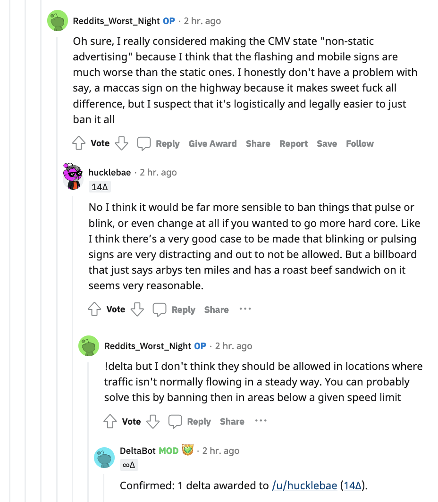

# Source of the corpus
[Reddit "Change My View"](https://www.reddit.com/r/changemyview/)

## What is CMV?
CMV stands for "Change My View."  CMV is a very popular community of online discussion that adheres to the following philosophy.

<cite>"CMV is a subreddit dedicated to civil discourse, and is built around the idea that in order to resolve our differences, we must first understand them. We believe that productive conversation requires respect and openness, and that certitude is the enemy of understanding."</cite> (cited from [here](https://www.reddit.com/r/changemyview/wiki/index))

## What is `delta thread`?
By the term `delta thread`, we refer to a series of comments posted by multiple participants, which eventually led to a change of participant's view. For example, below is a thread from the topic "Roadside advertising should be illegal." Here, the participant Reddits_Worst_Night granted "delta" to the participant hucklebae, which was then confirmed by DeltaBot (Reddit's bot that checks the validity of deltas). The six light-gray lines to the left of the delta giver Reddits_Worst_Night signifies this thread contains six comments in total.

## Why `delta thread`?
The delta is a footprint that shows there was constructive discussion among multiple people. By focusing on the delta threads, we hope to extract some linguistic characteristics that are present when people make persuasive discourse.

# Corpus
[Collected corpus](https://drive.google.com/drive/folders/1urhiaaoF-ur-tagKgRYeocxBcUp_48U_?usp=sharing) - last updated Mar 5
- Total number of documents: 2,235 submission posts and 2,513 delta threads
- Total number of words: 2,235,463 English words (997,477 words in the submissions + 1,237,986 words in the threads)
- Known problems: Data is scraped as is. For thorough data cleaning, preprocessing needs to be applied first systematically (e.g., stripping off carrige returns, unnecessary spacing) and then manually (e.g., remove enigmatic characters, incomplete sentence).
For the verification of the overall counts, please see [here](Corpus_Info.ipynb)

## File organization

The data is comprised of three files. 
- `submission.json` contains topic submission data ("submission" = the root comment submitted to post a new discussion topic)
- `delta_thread.json` contains a series of comments that eventually led to a change of perspective. That change is signified by `delta` signage. 
- `log.json` keeps track of scraping progress. 

### Data structure and metadata
`submission.json`
| Field name        | Type            | Description                  |
|-------------------|-----------------|------------------------------|
| submission_id     | list of strings | Reddit's submission ID       |
| submission_author | same as above   | Author's Reddit account name |
| submission_url    | same as above   | The link to the post         |
| submission_title  | same as above   | The title of the post        |
| submission_body   | same as above   | The body text of the post    |

`delta_thread.json`
| Field name | Type | Description                                                                     |
|------------|------|---------------------------------------------------------------------------------|
| thread_id  | dict | a dictionary where the key is `thread_id` and the value is a list of comments.  

`thread_id` is named after `{submission_id}-{comment_id}` so that each thread can be treated as a tree of children under the root of sumbmission (discussion topic).

`log.json`
| Field name      | Type     | Description                                                           |
|-----------------|----------|-----------------------------------------------------------------------|
| updated_at      | DateTime | Timestamp of the submission's initial post                            |
| updated_utc     | UTC      | Same as above but in UTC format                                       |
| delta_receivers | list     | Reddit users who have received one or more delta from some other user |
| todo            | list     | TODO list for a scraper                                               |
| done            | list     | DONE list for a scraper                                               |
| invalid_threads | list     | Threads that contain deleted or removed post/user.                    |

The log fields are used for controling the scraping process. For details, see `README.md` in `src/reddit_scraper`.